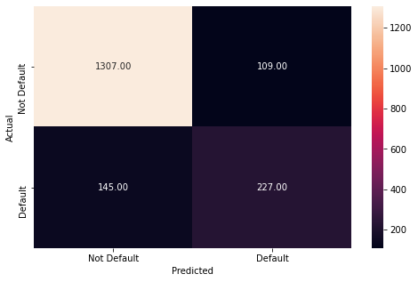
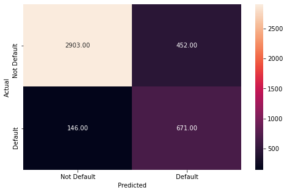
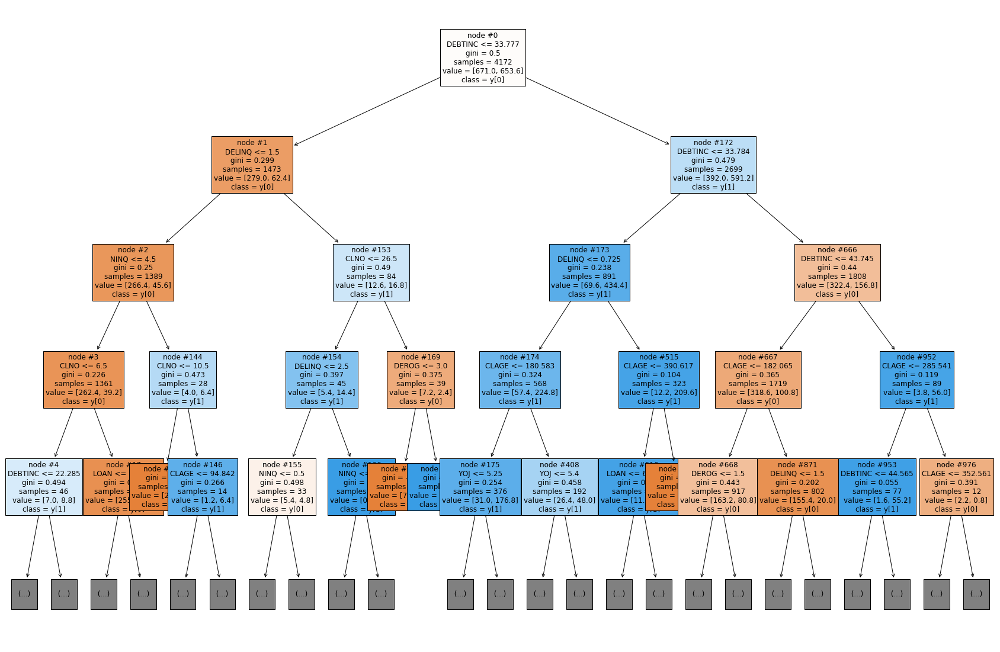

# Loan-Classification
#### DATASET USED NOT INCLUDED

# Project overview
- Predict if a customer will or will not default
- Important features
  - Debt to income ratio: The reason this may be an important feature in deciding whether a user will default or not because the more debt and less income a person has, the less chance that they will be able to pay back a loan
  - Delinquent credit lines: This may be an important feature because it shows that the persons payments are way past due, it shows that they are not able to pay back their credit cards and therefore may have a hard time paying back a loan
## Models Created
### Decision Tree Model
- The training data performance for the first decision tree model


- The test data performance for the first decision tree model


### Decision Tree Model Tuned
- The training data performance for the decision tree tuned model


- The test data performance for the decision tree tuned model


### Random Forest Model
- The training data performance for the random forest model


- The test data performance for the random forest model


### Random Forest Model Tuned
- The training data performance for the final random forest tuned model


- The test data performance for the final random forest tuned model


- As you can see, the untuned models on training data have perfect performance, meaning they are overfit, which leads to worse performance on test data
- To fix this I tuned the data, which equalized the performance and made it so it could work on more varied data
- The models used were decision tree and random forest
- Decision tree was faster but random forest was better at classifying

## Data Insights
- The graph below shows the data imbalance between loans that were paid back, and loans that were defaulted.
- We can see that there is a severe imbalance.
- In the future tuning we may want to fix this.
- 

- The graph to the right is a density plot of the loan amounts.
- We can see that most of the loans lie around the $20,000 mark.
- This is important because it shows what the risk of getting a prediction wrong is.
- 

- This graph shows the amount of loans that are for debt consolidation versus the loans that are taken for home improvement.
- This tells us that there are many more people who are getting a loan for debt, rather than for home improvement.
- 

## Markdown Version of Jupyter Notebook
### Loan Classification Project


```python
# Libraries we need
import pandas as pd
import numpy as np
import matplotlib.pyplot as plt
import seaborn as sns

from sklearn.preprocessing import StandardScaler

from sklearn.model_selection import train_test_split

from sklearn.discriminant_analysis import LinearDiscriminantAnalysis
from sklearn.discriminant_analysis import QuadraticDiscriminantAnalysis
from sklearn.linear_model import LogisticRegression
from sklearn.neighbors import KNeighborsClassifier

from sklearn import metrics
from sklearn.metrics import confusion_matrix, classification_report, precision_recall_curve,recall_score
from sklearn import tree
from sklearn.tree import DecisionTreeClassifier
from sklearn.ensemble import BaggingClassifier
from sklearn.ensemble import RandomForestClassifier

from sklearn.model_selection import GridSearchCV
```


```python
df = pd.read_csv("Dataset.csv")
```


```python
df.head()
```


<div>
<style scoped>
    .dataframe tbody tr th:only-of-type {
        vertical-align: middle;
    }

    .dataframe tbody tr th {
        vertical-align: top;
    }

    .dataframe thead th {
        text-align: right;
    }
</style>
<table border="1" class="dataframe">
  <thead>
    <tr style="text-align: right;">
      <th></th>
      <th>BAD</th>
      <th>LOAN</th>
      <th>MORTDUE</th>
      <th>VALUE</th>
      <th>REASON</th>
      <th>JOB</th>
      <th>YOJ</th>
      <th>DEROG</th>
      <th>DELINQ</th>
      <th>CLAGE</th>
      <th>NINQ</th>
      <th>CLNO</th>
      <th>DEBTINC</th>
    </tr>
  </thead>
  <tbody>
    <tr>
      <th>0</th>
      <td>1</td>
      <td>1100</td>
      <td>25860.0</td>
      <td>39025.0</td>
      <td>HomeImp</td>
      <td>Other</td>
      <td>10.5</td>
      <td>0.0</td>
      <td>0.0</td>
      <td>94.366667</td>
      <td>1.0</td>
      <td>9.0</td>
      <td>NaN</td>
    </tr>
    <tr>
      <th>1</th>
      <td>1</td>
      <td>1300</td>
      <td>70053.0</td>
      <td>68400.0</td>
      <td>HomeImp</td>
      <td>Other</td>
      <td>7.0</td>
      <td>0.0</td>
      <td>2.0</td>
      <td>121.833333</td>
      <td>0.0</td>
      <td>14.0</td>
      <td>NaN</td>
    </tr>
    <tr>
      <th>2</th>
      <td>1</td>
      <td>1500</td>
      <td>13500.0</td>
      <td>16700.0</td>
      <td>HomeImp</td>
      <td>Other</td>
      <td>4.0</td>
      <td>0.0</td>
      <td>0.0</td>
      <td>149.466667</td>
      <td>1.0</td>
      <td>10.0</td>
      <td>NaN</td>
    </tr>
    <tr>
      <th>3</th>
      <td>1</td>
      <td>1500</td>
      <td>NaN</td>
      <td>NaN</td>
      <td>NaN</td>
      <td>NaN</td>
      <td>NaN</td>
      <td>NaN</td>
      <td>NaN</td>
      <td>NaN</td>
      <td>NaN</td>
      <td>NaN</td>
      <td>NaN</td>
    </tr>
    <tr>
      <th>4</th>
      <td>0</td>
      <td>1700</td>
      <td>97800.0</td>
      <td>112000.0</td>
      <td>HomeImp</td>
      <td>Office</td>
      <td>3.0</td>
      <td>0.0</td>
      <td>0.0</td>
      <td>93.333333</td>
      <td>0.0</td>
      <td>14.0</td>
      <td>NaN</td>
    </tr>
  </tbody>
</table>
</div>


```python
df.info()
```

    <class 'pandas.core.frame.DataFrame'>
    RangeIndex: 5960 entries, 0 to 5959
    Data columns (total 13 columns):
     #   Column   Non-Null Count  Dtype  
    ---  ------   --------------  -----  
     0   BAD      5960 non-null   int64  
     1   LOAN     5960 non-null   int64  
     2   MORTDUE  5442 non-null   float64
     3   VALUE    5848 non-null   float64
     4   REASON   5708 non-null   object 
     5   JOB      5681 non-null   object 
     6   YOJ      5445 non-null   float64
     7   DEROG    5252 non-null   float64
     8   DELINQ   5380 non-null   float64
     9   CLAGE    5652 non-null   float64
     10  NINQ     5450 non-null   float64
     11  CLNO     5738 non-null   float64
     12  DEBTINC  4693 non-null   float64
    dtypes: float64(9), int64(2), object(2)
    memory usage: 605.4+ KB
    


```python
df.nunique()
```


    BAD           2
    LOAN        540
    MORTDUE    5053
    VALUE      5381
    REASON        2
    JOB           6
    YOJ          99
    DEROG        11
    DELINQ       14
    CLAGE      5314
    NINQ         16
    CLNO         62
    DEBTINC    4693
    dtype: int64


- Above we can see that Reason and Bad are binary variables
- Nothing needs to be dropped


```python
df.describe()
```


<div>
<style scoped>
    .dataframe tbody tr th:only-of-type {
        vertical-align: middle;
    }

    .dataframe tbody tr th {
        vertical-align: top;
    }

    .dataframe thead th {
        text-align: right;
    }
</style>
<table border="1" class="dataframe">
  <thead>
    <tr style="text-align: right;">
      <th></th>
      <th>BAD</th>
      <th>LOAN</th>
      <th>MORTDUE</th>
      <th>VALUE</th>
      <th>YOJ</th>
      <th>DEROG</th>
      <th>DELINQ</th>
      <th>CLAGE</th>
      <th>NINQ</th>
      <th>CLNO</th>
      <th>DEBTINC</th>
    </tr>
  </thead>
  <tbody>
    <tr>
      <th>count</th>
      <td>5960.000000</td>
      <td>5960.000000</td>
      <td>5442.000000</td>
      <td>5848.000000</td>
      <td>5445.000000</td>
      <td>5252.000000</td>
      <td>5380.000000</td>
      <td>5652.000000</td>
      <td>5450.000000</td>
      <td>5738.000000</td>
      <td>4693.000000</td>
    </tr>
    <tr>
      <th>mean</th>
      <td>0.199497</td>
      <td>18607.969799</td>
      <td>73760.817200</td>
      <td>101776.048741</td>
      <td>8.922268</td>
      <td>0.254570</td>
      <td>0.449442</td>
      <td>179.766275</td>
      <td>1.186055</td>
      <td>21.296096</td>
      <td>33.779915</td>
    </tr>
    <tr>
      <th>std</th>
      <td>0.399656</td>
      <td>11207.480417</td>
      <td>44457.609458</td>
      <td>57385.775334</td>
      <td>7.573982</td>
      <td>0.846047</td>
      <td>1.127266</td>
      <td>85.810092</td>
      <td>1.728675</td>
      <td>10.138933</td>
      <td>8.601746</td>
    </tr>
    <tr>
      <th>min</th>
      <td>0.000000</td>
      <td>1100.000000</td>
      <td>2063.000000</td>
      <td>8000.000000</td>
      <td>0.000000</td>
      <td>0.000000</td>
      <td>0.000000</td>
      <td>0.000000</td>
      <td>0.000000</td>
      <td>0.000000</td>
      <td>0.524499</td>
    </tr>
    <tr>
      <th>25%</th>
      <td>0.000000</td>
      <td>11100.000000</td>
      <td>46276.000000</td>
      <td>66075.500000</td>
      <td>3.000000</td>
      <td>0.000000</td>
      <td>0.000000</td>
      <td>115.116702</td>
      <td>0.000000</td>
      <td>15.000000</td>
      <td>29.140031</td>
    </tr>
    <tr>
      <th>50%</th>
      <td>0.000000</td>
      <td>16300.000000</td>
      <td>65019.000000</td>
      <td>89235.500000</td>
      <td>7.000000</td>
      <td>0.000000</td>
      <td>0.000000</td>
      <td>173.466667</td>
      <td>1.000000</td>
      <td>20.000000</td>
      <td>34.818262</td>
    </tr>
    <tr>
      <th>75%</th>
      <td>0.000000</td>
      <td>23300.000000</td>
      <td>91488.000000</td>
      <td>119824.250000</td>
      <td>13.000000</td>
      <td>0.000000</td>
      <td>0.000000</td>
      <td>231.562278</td>
      <td>2.000000</td>
      <td>26.000000</td>
      <td>39.003141</td>
    </tr>
    <tr>
      <th>max</th>
      <td>1.000000</td>
      <td>89900.000000</td>
      <td>399550.000000</td>
      <td>855909.000000</td>
      <td>41.000000</td>
      <td>10.000000</td>
      <td>15.000000</td>
      <td>1168.233561</td>
      <td>17.000000</td>
      <td>71.000000</td>
      <td>203.312149</td>
    </tr>
  </tbody>
</table>
</div>


```python
plt.hist(df['BAD'], bins=3)
plt.show()
```


    

    


```python
df['LOAN'].plot(kind='density')
plt.show()
```


    

    


```python
plt.pie(df['REASON'].value_counts(), labels=['DebtCon', 'HomeImp'], autopct='%.1f')
plt.show()
df['REASON'].value_counts()
```


    

    


    DebtCon    3928
    HomeImp    1780
    Name: REASON, dtype: int64


```python
correlation = df.corr()
sns.heatmap(correlation)
plt.show()
```


    

    


```python
df['BAD'].value_counts(normalize=True)
```


    0    0.800503
    1    0.199497
    Name: BAD, dtype: float64


```python
df.fillna(df.mean(), inplace=True)
```


```python
one_hot_encoding = pd.get_dummies(df['REASON'])
df = df.drop('REASON', axis=1)
df = df.join(one_hot_encoding)
df
```


<div>
<style scoped>
    .dataframe tbody tr th:only-of-type {
        vertical-align: middle;
    }

    .dataframe tbody tr th {
        vertical-align: top;
    }

    .dataframe thead th {
        text-align: right;
    }
</style>
<table border="1" class="dataframe">
  <thead>
    <tr style="text-align: right;">
      <th></th>
      <th>BAD</th>
      <th>LOAN</th>
      <th>MORTDUE</th>
      <th>VALUE</th>
      <th>JOB</th>
      <th>YOJ</th>
      <th>DEROG</th>
      <th>DELINQ</th>
      <th>CLAGE</th>
      <th>NINQ</th>
      <th>CLNO</th>
      <th>DEBTINC</th>
      <th>DebtCon</th>
      <th>HomeImp</th>
    </tr>
  </thead>
  <tbody>
    <tr>
      <th>0</th>
      <td>1</td>
      <td>1100</td>
      <td>25860.0000</td>
      <td>39025.000000</td>
      <td>Other</td>
      <td>10.500000</td>
      <td>0.00000</td>
      <td>0.000000</td>
      <td>94.366667</td>
      <td>1.000000</td>
      <td>9.000000</td>
      <td>33.779915</td>
      <td>0</td>
      <td>1</td>
    </tr>
    <tr>
      <th>1</th>
      <td>1</td>
      <td>1300</td>
      <td>70053.0000</td>
      <td>68400.000000</td>
      <td>Other</td>
      <td>7.000000</td>
      <td>0.00000</td>
      <td>2.000000</td>
      <td>121.833333</td>
      <td>0.000000</td>
      <td>14.000000</td>
      <td>33.779915</td>
      <td>0</td>
      <td>1</td>
    </tr>
    <tr>
      <th>2</th>
      <td>1</td>
      <td>1500</td>
      <td>13500.0000</td>
      <td>16700.000000</td>
      <td>Other</td>
      <td>4.000000</td>
      <td>0.00000</td>
      <td>0.000000</td>
      <td>149.466667</td>
      <td>1.000000</td>
      <td>10.000000</td>
      <td>33.779915</td>
      <td>0</td>
      <td>1</td>
    </tr>
    <tr>
      <th>3</th>
      <td>1</td>
      <td>1500</td>
      <td>73760.8172</td>
      <td>101776.048741</td>
      <td>NaN</td>
      <td>8.922268</td>
      <td>0.25457</td>
      <td>0.449442</td>
      <td>179.766275</td>
      <td>1.186055</td>
      <td>21.296096</td>
      <td>33.779915</td>
      <td>0</td>
      <td>0</td>
    </tr>
    <tr>
      <th>4</th>
      <td>0</td>
      <td>1700</td>
      <td>97800.0000</td>
      <td>112000.000000</td>
      <td>Office</td>
      <td>3.000000</td>
      <td>0.00000</td>
      <td>0.000000</td>
      <td>93.333333</td>
      <td>0.000000</td>
      <td>14.000000</td>
      <td>33.779915</td>
      <td>0</td>
      <td>1</td>
    </tr>
    <tr>
      <th>...</th>
      <td>...</td>
      <td>...</td>
      <td>...</td>
      <td>...</td>
      <td>...</td>
      <td>...</td>
      <td>...</td>
      <td>...</td>
      <td>...</td>
      <td>...</td>
      <td>...</td>
      <td>...</td>
      <td>...</td>
      <td>...</td>
    </tr>
    <tr>
      <th>5955</th>
      <td>0</td>
      <td>88900</td>
      <td>57264.0000</td>
      <td>90185.000000</td>
      <td>Other</td>
      <td>16.000000</td>
      <td>0.00000</td>
      <td>0.000000</td>
      <td>221.808718</td>
      <td>0.000000</td>
      <td>16.000000</td>
      <td>36.112347</td>
      <td>1</td>
      <td>0</td>
    </tr>
    <tr>
      <th>5956</th>
      <td>0</td>
      <td>89000</td>
      <td>54576.0000</td>
      <td>92937.000000</td>
      <td>Other</td>
      <td>16.000000</td>
      <td>0.00000</td>
      <td>0.000000</td>
      <td>208.692070</td>
      <td>0.000000</td>
      <td>15.000000</td>
      <td>35.859971</td>
      <td>1</td>
      <td>0</td>
    </tr>
    <tr>
      <th>5957</th>
      <td>0</td>
      <td>89200</td>
      <td>54045.0000</td>
      <td>92924.000000</td>
      <td>Other</td>
      <td>15.000000</td>
      <td>0.00000</td>
      <td>0.000000</td>
      <td>212.279697</td>
      <td>0.000000</td>
      <td>15.000000</td>
      <td>35.556590</td>
      <td>1</td>
      <td>0</td>
    </tr>
    <tr>
      <th>5958</th>
      <td>0</td>
      <td>89800</td>
      <td>50370.0000</td>
      <td>91861.000000</td>
      <td>Other</td>
      <td>14.000000</td>
      <td>0.00000</td>
      <td>0.000000</td>
      <td>213.892709</td>
      <td>0.000000</td>
      <td>16.000000</td>
      <td>34.340882</td>
      <td>1</td>
      <td>0</td>
    </tr>
    <tr>
      <th>5959</th>
      <td>0</td>
      <td>89900</td>
      <td>48811.0000</td>
      <td>88934.000000</td>
      <td>Other</td>
      <td>15.000000</td>
      <td>0.00000</td>
      <td>0.000000</td>
      <td>219.601002</td>
      <td>0.000000</td>
      <td>16.000000</td>
      <td>34.571519</td>
      <td>1</td>
      <td>0</td>
    </tr>
  </tbody>
</table>
<p>5960 rows × 14 columns</p>
</div>


```python
one_hot_encoding2 = pd.get_dummies(df['JOB'])
df = df.drop('JOB', axis=1)
df = df.join(one_hot_encoding2)
df
```


<div>
<style scoped>
    .dataframe tbody tr th:only-of-type {
        vertical-align: middle;
    }

    .dataframe tbody tr th {
        vertical-align: top;
    }

    .dataframe thead th {
        text-align: right;
    }
</style>
<table border="1" class="dataframe">
  <thead>
    <tr style="text-align: right;">
      <th></th>
      <th>BAD</th>
      <th>LOAN</th>
      <th>MORTDUE</th>
      <th>VALUE</th>
      <th>YOJ</th>
      <th>DEROG</th>
      <th>DELINQ</th>
      <th>CLAGE</th>
      <th>NINQ</th>
      <th>CLNO</th>
      <th>DEBTINC</th>
      <th>DebtCon</th>
      <th>HomeImp</th>
      <th>Mgr</th>
      <th>Office</th>
      <th>Other</th>
      <th>ProfExe</th>
      <th>Sales</th>
      <th>Self</th>
    </tr>
  </thead>
  <tbody>
    <tr>
      <th>0</th>
      <td>1</td>
      <td>1100</td>
      <td>25860.0000</td>
      <td>39025.000000</td>
      <td>10.500000</td>
      <td>0.00000</td>
      <td>0.000000</td>
      <td>94.366667</td>
      <td>1.000000</td>
      <td>9.000000</td>
      <td>33.779915</td>
      <td>0</td>
      <td>1</td>
      <td>0</td>
      <td>0</td>
      <td>1</td>
      <td>0</td>
      <td>0</td>
      <td>0</td>
    </tr>
    <tr>
      <th>1</th>
      <td>1</td>
      <td>1300</td>
      <td>70053.0000</td>
      <td>68400.000000</td>
      <td>7.000000</td>
      <td>0.00000</td>
      <td>2.000000</td>
      <td>121.833333</td>
      <td>0.000000</td>
      <td>14.000000</td>
      <td>33.779915</td>
      <td>0</td>
      <td>1</td>
      <td>0</td>
      <td>0</td>
      <td>1</td>
      <td>0</td>
      <td>0</td>
      <td>0</td>
    </tr>
    <tr>
      <th>2</th>
      <td>1</td>
      <td>1500</td>
      <td>13500.0000</td>
      <td>16700.000000</td>
      <td>4.000000</td>
      <td>0.00000</td>
      <td>0.000000</td>
      <td>149.466667</td>
      <td>1.000000</td>
      <td>10.000000</td>
      <td>33.779915</td>
      <td>0</td>
      <td>1</td>
      <td>0</td>
      <td>0</td>
      <td>1</td>
      <td>0</td>
      <td>0</td>
      <td>0</td>
    </tr>
    <tr>
      <th>3</th>
      <td>1</td>
      <td>1500</td>
      <td>73760.8172</td>
      <td>101776.048741</td>
      <td>8.922268</td>
      <td>0.25457</td>
      <td>0.449442</td>
      <td>179.766275</td>
      <td>1.186055</td>
      <td>21.296096</td>
      <td>33.779915</td>
      <td>0</td>
      <td>0</td>
      <td>0</td>
      <td>0</td>
      <td>0</td>
      <td>0</td>
      <td>0</td>
      <td>0</td>
    </tr>
    <tr>
      <th>4</th>
      <td>0</td>
      <td>1700</td>
      <td>97800.0000</td>
      <td>112000.000000</td>
      <td>3.000000</td>
      <td>0.00000</td>
      <td>0.000000</td>
      <td>93.333333</td>
      <td>0.000000</td>
      <td>14.000000</td>
      <td>33.779915</td>
      <td>0</td>
      <td>1</td>
      <td>0</td>
      <td>1</td>
      <td>0</td>
      <td>0</td>
      <td>0</td>
      <td>0</td>
    </tr>
    <tr>
      <th>...</th>
      <td>...</td>
      <td>...</td>
      <td>...</td>
      <td>...</td>
      <td>...</td>
      <td>...</td>
      <td>...</td>
      <td>...</td>
      <td>...</td>
      <td>...</td>
      <td>...</td>
      <td>...</td>
      <td>...</td>
      <td>...</td>
      <td>...</td>
      <td>...</td>
      <td>...</td>
      <td>...</td>
      <td>...</td>
    </tr>
    <tr>
      <th>5955</th>
      <td>0</td>
      <td>88900</td>
      <td>57264.0000</td>
      <td>90185.000000</td>
      <td>16.000000</td>
      <td>0.00000</td>
      <td>0.000000</td>
      <td>221.808718</td>
      <td>0.000000</td>
      <td>16.000000</td>
      <td>36.112347</td>
      <td>1</td>
      <td>0</td>
      <td>0</td>
      <td>0</td>
      <td>1</td>
      <td>0</td>
      <td>0</td>
      <td>0</td>
    </tr>
    <tr>
      <th>5956</th>
      <td>0</td>
      <td>89000</td>
      <td>54576.0000</td>
      <td>92937.000000</td>
      <td>16.000000</td>
      <td>0.00000</td>
      <td>0.000000</td>
      <td>208.692070</td>
      <td>0.000000</td>
      <td>15.000000</td>
      <td>35.859971</td>
      <td>1</td>
      <td>0</td>
      <td>0</td>
      <td>0</td>
      <td>1</td>
      <td>0</td>
      <td>0</td>
      <td>0</td>
    </tr>
    <tr>
      <th>5957</th>
      <td>0</td>
      <td>89200</td>
      <td>54045.0000</td>
      <td>92924.000000</td>
      <td>15.000000</td>
      <td>0.00000</td>
      <td>0.000000</td>
      <td>212.279697</td>
      <td>0.000000</td>
      <td>15.000000</td>
      <td>35.556590</td>
      <td>1</td>
      <td>0</td>
      <td>0</td>
      <td>0</td>
      <td>1</td>
      <td>0</td>
      <td>0</td>
      <td>0</td>
    </tr>
    <tr>
      <th>5958</th>
      <td>0</td>
      <td>89800</td>
      <td>50370.0000</td>
      <td>91861.000000</td>
      <td>14.000000</td>
      <td>0.00000</td>
      <td>0.000000</td>
      <td>213.892709</td>
      <td>0.000000</td>
      <td>16.000000</td>
      <td>34.340882</td>
      <td>1</td>
      <td>0</td>
      <td>0</td>
      <td>0</td>
      <td>1</td>
      <td>0</td>
      <td>0</td>
      <td>0</td>
    </tr>
    <tr>
      <th>5959</th>
      <td>0</td>
      <td>89900</td>
      <td>48811.0000</td>
      <td>88934.000000</td>
      <td>15.000000</td>
      <td>0.00000</td>
      <td>0.000000</td>
      <td>219.601002</td>
      <td>0.000000</td>
      <td>16.000000</td>
      <td>34.571519</td>
      <td>1</td>
      <td>0</td>
      <td>0</td>
      <td>0</td>
      <td>1</td>
      <td>0</td>
      <td>0</td>
      <td>0</td>
    </tr>
  </tbody>
</table>
<p>5960 rows × 19 columns</p>
</div>


```python
dependent = df['BAD']
independent = df.drop(['BAD'], axis=1)
x_train, x_test, y_train, y_test = train_test_split(independent, dependent, test_size=0.3, random_state=1)
```


```python
def metrics_score(actual, predicted):
    print(classification_report(actual, predicted))
    cm = confusion_matrix(actual, predicted)
    plt.figure(figsize=(8,5))
    sns.heatmap(cm, annot=True,  fmt='.2f', xticklabels=['Not Default', 'Default'], yticklabels=['Not Default', 'Default'])
    plt.ylabel('Actual')
    plt.xlabel('Predicted')
    plt.show()
```


```python
dtree = DecisionTreeClassifier(class_weight={0:0.20, 1:0.80}, random_state=1)
```


```python
dtree.fit(x_train, y_train)
```


    DecisionTreeClassifier(class_weight={0: 0.2, 1: 0.8}, random_state=1)


```python
dependent_performance_dt = dtree.predict(x_train)
metrics_score(y_train, dependent_performance_dt)
```

                  precision    recall  f1-score   support
    
               0       1.00      1.00      1.00      3355
               1       1.00      1.00      1.00       817
    
        accuracy                           1.00      4172
       macro avg       1.00      1.00      1.00      4172
    weighted avg       1.00      1.00      1.00      4172
    
    


    

    


- The above is perfect because we are using the train values, not the test
- Lets test on test data


```python
dependent_test_performance_dt = dtree.predict(x_test)
metrics_score(y_test,dependent_test_performance_dt)
```

                  precision    recall  f1-score   support
    
               0       0.90      0.92      0.91      1416
               1       0.68      0.61      0.64       372
    
        accuracy                           0.86      1788
       macro avg       0.79      0.77      0.78      1788
    weighted avg       0.85      0.86      0.86      1788
    
    


    

    


- As we can see, we got decent performance from this model, lets see if we can do better
- Selfnote: do importance features next


```python
important = dtree.feature_importances_
columns = independent.columns
important_items_df = pd.DataFrame(important, index=columns, columns=['Importance']).sort_values(by='Importance', ascending=False)
plt.figure(figsize=(13,13))
sns.barplot(important_items_df.Importance, important_items_df.index)
plt.show()
```

    C:\ProgramData\Anaconda3\lib\site-packages\seaborn\_decorators.py:36: FutureWarning: Pass the following variables as keyword args: x, y. From version 0.12, the only valid positional argument will be `data`, and passing other arguments without an explicit keyword will result in an error or misinterpretation.
      warnings.warn(
    


    

    


- I followed this from a previous project to see the most important features
- We can see that the most important features are DEBTINC, CLAGE and CLNO


```python
tree_estimator = DecisionTreeClassifier(class_weight={0:0.20, 1:0.80}, random_state=1)

parameters = {
    'max_depth':np.arange(2,7),
    'criterion':['gini', 'entropy'],
    'min_samples_leaf':[5,10,20,25]
             }
score = metrics.make_scorer(recall_score, pos_label=1)
gridCV= GridSearchCV(tree_estimator, parameters, scoring=score,cv=10)
gridCV = gridCV.fit(x_train, y_train) 
tree_estimator = gridCV.best_estimator_
tree_estimator.fit(x_train, y_train)
```


    DecisionTreeClassifier(class_weight={0: 0.2, 1: 0.8}, max_depth=6,
                           min_samples_leaf=25, random_state=1)


```python
dependent_performance_dt = tree_estimator.predict(x_train)
metrics_score(y_train, dependent_performance_dt)
```

                  precision    recall  f1-score   support
    
               0       0.95      0.87      0.91      3355
               1       0.60      0.82      0.69       817
    
        accuracy                           0.86      4172
       macro avg       0.77      0.84      0.80      4172
    weighted avg       0.88      0.86      0.86      4172
    
    


    

    


- We increased the less harmful error but decreased the harmful error


```python
dependent_test_performance_dt = tree_estimator.predict(x_test)
metrics_score(y_test, dependent_test_performance_dt)
```

                  precision    recall  f1-score   support
    
               0       0.94      0.86      0.90      1416
               1       0.60      0.77      0.67       372
    
        accuracy                           0.84      1788
       macro avg       0.77      0.82      0.79      1788
    weighted avg       0.87      0.84      0.85      1788
    
    


    

    


- Although the performance is slightly worse, we still reduce harmful error


```python
important = tree_estimator.feature_importances_
columns=independent.columns
importance_df=pd.DataFrame(important,index=columns,columns=['Importance']).sort_values(by='Importance',ascending=False)
plt.figure(figsize=(13,13))
sns.barplot(importance_df.Importance,importance_df.index)
plt.show()
```

    C:\ProgramData\Anaconda3\lib\site-packages\seaborn\_decorators.py:36: FutureWarning: Pass the following variables as keyword args: x, y. From version 0.12, the only valid positional argument will be `data`, and passing other arguments without an explicit keyword will result in an error or misinterpretation.
      warnings.warn(
    


    

    


```python
features = list(independent.columns)

plt.figure(figsize=(30,20))

tree.plot_tree(dtree,max_depth=4,feature_names=features,filled=True,fontsize=12,node_ids=True,class_names=True)
plt.show()
```


    

    


- A visualization is one of the advantages that dtrees offer, we can show this to the client ot show the thought process


```python
forest_estimator = RandomForestClassifier(class_weight={0:0.20, 1:0.80}, random_state=1)
forest_estimator.fit(x_train, y_train)
```


    RandomForestClassifier(class_weight={0: 0.2, 1: 0.8}, random_state=1)


```python
y_predict_training_forest = forest_estimator.predict(x_train)
metrics_score(y_train, y_predict_training_forest)
```

                  precision    recall  f1-score   support
    
               0       1.00      1.00      1.00      3355
               1       1.00      1.00      1.00       817
    
        accuracy                           1.00      4172
       macro avg       1.00      1.00      1.00      4172
    weighted avg       1.00      1.00      1.00      4172
    
    


    

    


- A perfect classification
  - This implies overfitting


```python
y_predict_test_forest = forest_estimator.predict(x_test)
metrics_score(y_test, y_predict_test_forest)
```

                  precision    recall  f1-score   support
    
               0       0.91      0.98      0.95      1416
               1       0.91      0.65      0.76       372
    
        accuracy                           0.91      1788
       macro avg       0.91      0.82      0.85      1788
    weighted avg       0.91      0.91      0.91      1788
    
    


    

    


- The performance is a lot better than the original single tree
- Lets fix overfitting


```python
forest_estimator_tuned = RandomForestClassifier(class_weight={0:0.20,1:0.80}, random_state=1)

parameters_rf = {  
        "n_estimators": [100,250,500],
        "min_samples_leaf": np.arange(1, 4,1),
        "max_features": [0.7,0.9,'auto'],
}

score = metrics.make_scorer(recall_score, pos_label=1)

# Run the grid search
grid_obj = GridSearchCV(forest_estimator_tuned, parameters_rf, scoring=score, cv=5)
grid_obj = grid_obj.fit(x_train, y_train)

# Set the clf to the best combination of parameters
forest_estimator_tuned = grid_obj.best_estimator_
```


```python
forest_estimator_tuned.fit(x_train, y_train)
```


    RandomForestClassifier(class_weight={0: 0.2, 1: 0.8}, min_samples_leaf=3,
                           n_estimators=500, random_state=1)


```python
y_predict_train_forest_tuned = forest_estimator_tuned.predict(x_train)
metrics_score(y_train, y_predict_train_forest_tuned)
```

                  precision    recall  f1-score   support
    
               0       1.00      0.98      0.99      3355
               1       0.93      0.99      0.96       817
    
        accuracy                           0.98      4172
       macro avg       0.96      0.99      0.97      4172
    weighted avg       0.98      0.98      0.98      4172
    
    


    

    


```python
y_predict_test_forest_tuned = forest_estimator_tuned.predict(x_test)
metrics_score(y_test, y_predict_test_forest_tuned)
```

                  precision    recall  f1-score   support
    
               0       0.94      0.96      0.95      1416
               1       0.83      0.75      0.79       372
    
        accuracy                           0.92      1788
       macro avg       0.88      0.86      0.87      1788
    weighted avg       0.91      0.92      0.92      1788
    
    


    

    


- We now have very good performance
- We can submit this to the company

### Conclusion
- I made many models to get the best results.
  - The first one I made was a decision tree, this is not as good as random forest but it is transparent as it lets us visualize it. This first one had decent performance.
  - To improve the performance of this we tried to tune the model, this reduced the harmful error.
  - Then to improve even more I created a decision tree model, this had excellent performance once we created a second version which removed overfitting.

### Recommendations
- The biggest thing that effects defaulting on a loan is the debt to income ratio. If someone has a lot of debt and a lower income they may have a harder time paying back a loan.
- Something else that effects defaulting on a loan is the number of delinquent credit lines. This means that someone who cannot make their credit card payments will have a hard time paying back a loan.
- Years at job is also a driver of a loans outcome. A large number of years at a job could indicate financial stability.
- DEROG, or a history of delinquent payments is also a warning sign of not being able to pay back a loan.
- Those are some warning signs/good signs that should be looked out for when looking for candidates to give loans to.

I will now apply SHAP to look more into this model.


```python
!pip install shap
import shap
```

    Requirement already satisfied: shap in c:\programdata\anaconda3\lib\site-packages (0.39.0)
    Requirement already satisfied: scipy in c:\programdata\anaconda3\lib\site-packages (from shap) (1.6.2)
    Requirement already satisfied: numpy in c:\programdata\anaconda3\lib\site-packages (from shap) (1.20.1)
    Requirement already satisfied: numba in c:\programdata\anaconda3\lib\site-packages (from shap) (0.53.1)
    Requirement already satisfied: slicer==0.0.7 in c:\programdata\anaconda3\lib\site-packages (from shap) (0.0.7)
    Requirement already satisfied: cloudpickle in c:\programdata\anaconda3\lib\site-packages (from shap) (1.6.0)
    Requirement already satisfied: pandas in c:\programdata\anaconda3\lib\site-packages (from shap) (1.2.4)
    Requirement already satisfied: scikit-learn in c:\programdata\anaconda3\lib\site-packages (from shap) (0.24.1)
    Requirement already satisfied: tqdm>4.25.0 in c:\programdata\anaconda3\lib\site-packages (from shap) (4.59.0)
    Requirement already satisfied: setuptools in c:\programdata\anaconda3\lib\site-packages (from numba->shap) (52.0.0.post20210125)
    Requirement already satisfied: llvmlite<0.37,>=0.36.0rc1 in c:\programdata\anaconda3\lib\site-packages (from numba->shap) (0.36.0)
    Requirement already satisfied: pytz>=2017.3 in c:\programdata\anaconda3\lib\site-packages (from pandas->shap) (2021.1)
    Requirement already satisfied: python-dateutil>=2.7.3 in c:\programdata\anaconda3\lib\site-packages (from pandas->shap) (2.8.1)
    Requirement already satisfied: six>=1.5 in c:\programdata\anaconda3\lib\site-packages (from python-dateutil>=2.7.3->pandas->shap) (1.15.0)
    Requirement already satisfied: joblib>=0.11 in c:\programdata\anaconda3\lib\site-packages (from scikit-learn->shap) (1.0.1)
    Requirement already satisfied: threadpoolctl>=2.0.0 in c:\programdata\anaconda3\lib\site-packages (from scikit-learn->shap) (2.1.0)
    


```python
shap.initjs()
```


<div align='center'></div>


```python
explain = shap.TreeExplainer(forest_estimator_tuned)
shap_vals = explain(x_train)
```


```python
type(shap_vals)
```


    shap._explanation.Explanation


```python
shap.plots.bar(shap_vals[:, :, 0])
```


    

    


```python
shap.plots.heatmap(shap_vals[:, :, 0])
```


    

    


```python
shap.summary_plot(shap_vals[:, :, 0], x_train)
```


    

    


```python
print(forest_estimator_tuned.predict(x_test.iloc[107].to_numpy().reshape(1,-1))) # This predicts for one row, 0 means approved, 1 means no.
```

    [1]
    
